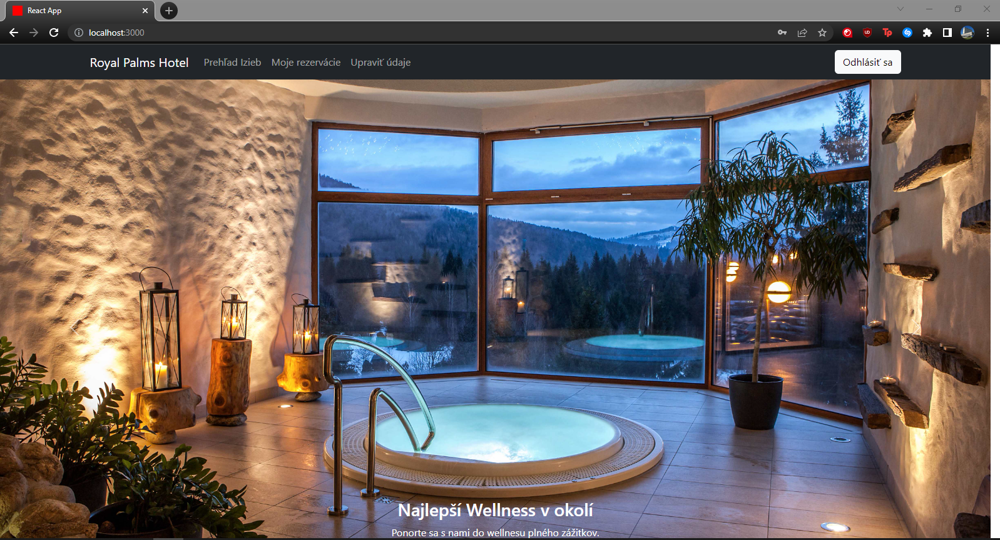
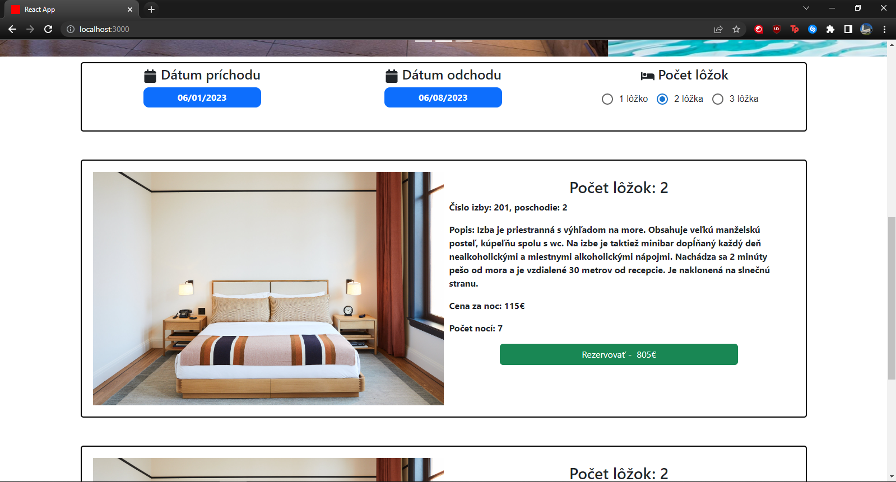
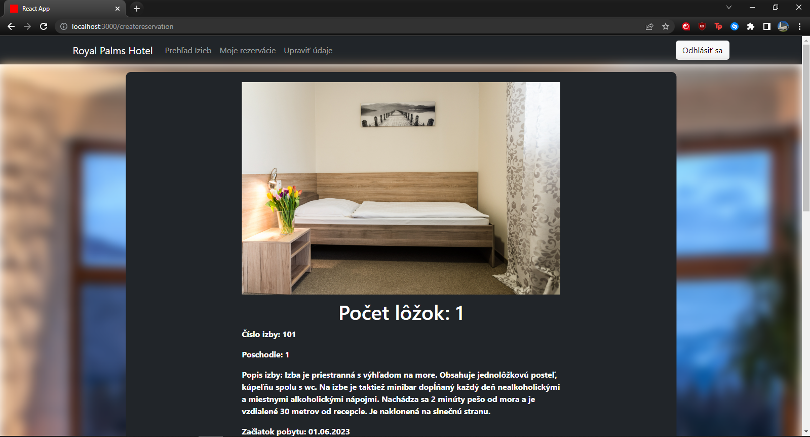
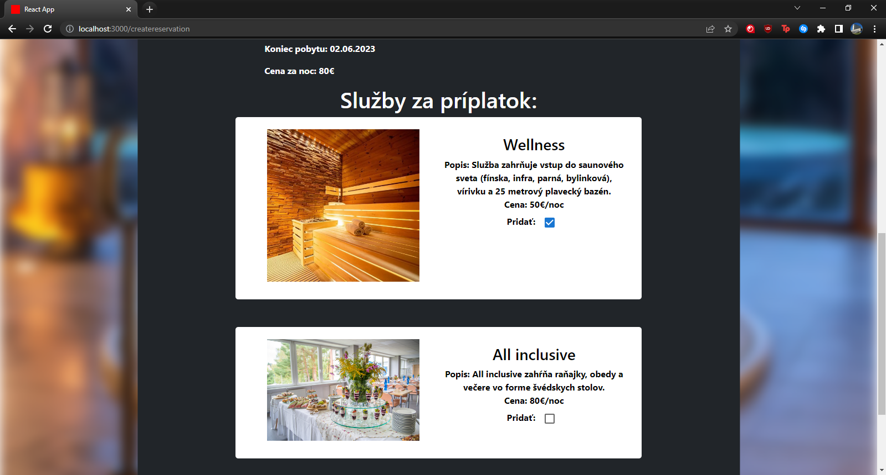
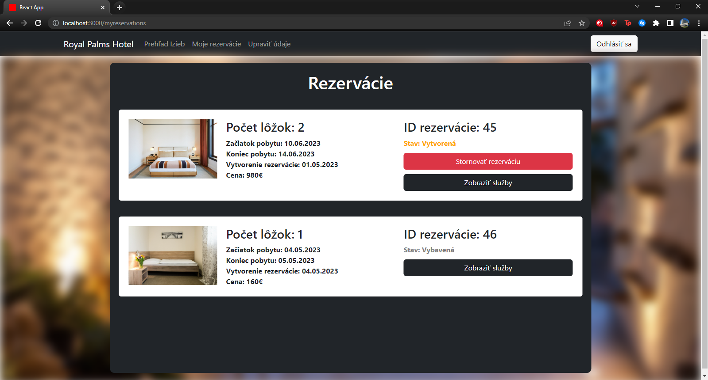
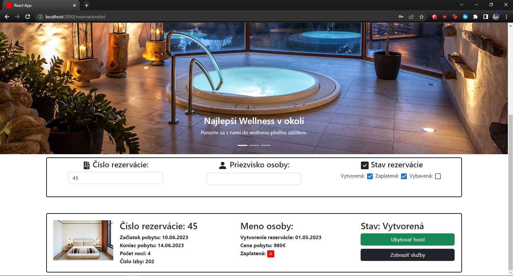

# Information system for hotel room reservations

Authors:

- Jakub Zaukolec
- Jozef Čásar

Used technologies:

- React
- REST API (axios)
- React Router

### Backend for this application was done by our classmates and repo is private

Screenshots:

